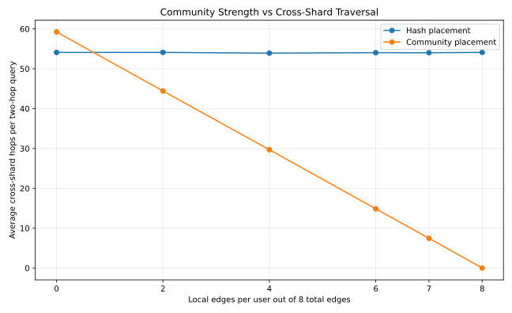
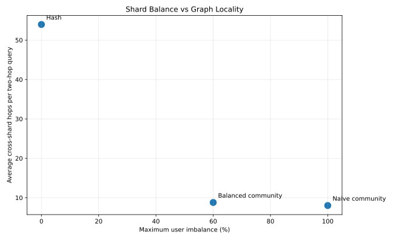

# GraphShard Lab

GraphShard Lab is a Rust research prototype for studying how graph data placement and query execution affect shard balance and cross-shard work.

It focuses on one main question:

> How should connected graph data be placed and queried across shards?

The project compares:

- hash-based placement;
- community-based placement;
- balanced community placement;
- direct two-hop query execution;
- batched two-hop query execution.

All shards are logical, in-memory shards running inside one Rust process.

## Key findings

### Community-aware placement improves locality

In a synthetic workload with:

- 10,000 users;
- 8 outgoing edges per user;
- 7 of those 8 edges staying inside the user’s community;
- 4 logical shards;

the results were:

| Placement | Average cross-shard hops |
|---|---:|
| Hash | 54.02 |
| Community | 7.46 |

Community placement produced **86.19% fewer logical cross-shard hops** than hash placement in this workload.



### Batching reduces logical shard requests

The project also compares two ways of executing the same two-hop query.

**Direct execution**

Each first-hop user is read separately.

```text
Read user A
Read user B
Read user C
```

**Batched execution**

First-hop users are grouped by shard.

```text
Shard 1: read users A and B together
Shard 2: read user C
```

Direct execution used `9.00` logical shard requests per query.

Across the locality sweep, batched execution used between `2.00` and `4.52` requests, reducing logical shard requests by **49.74% to 77.78%**.

Both execution methods returned exactly the same query results.


These are logical request counts inside an in-process prototype, not real network requests or measured latency.

## Uneven communities create a balance trade-off

The uneven-community workload uses these community sizes:

```text
[4000, 2500, 1500, 1000, 1000]
```

| Placement           | Users per shard              | Max imbalance | Avg hops | Batched request reduction |
|----------------------|-------------------------------|---------------:|----------:|---------------------------:|
| Hash                 | `[2500, 2500, 2500, 2500]`    | 0%             | 53.97     | 48.84%                     |
| Naive community      | `[5000, 2500, 1500, 1000]`    | 100%           | 8.02      | 67.91%                     |
| Balanced community   | `[4000, 2500, 1500, 2000]`    | 60%            | 8.79      | 66.93%                     |

Hash placement gives perfect balance but poor graph locality.

Naive community placement gives strong locality but may overload a shard.

Balanced community placement keeps most of the locality benefit while improving the distribution.

The remaining 60% imbalance cannot be removed without splitting the largest 4,000-user community.



## Graph model

Users are graph nodes.

A directed `FOLLOWS` relationship is an edge:

```text
Alice → Bob
Bob → Charlie
```

A two-hop query starting from Alice follows:

```text
Alice → Bob → Charlie
```

The result is Charlie.

The project removes duplicate results and excludes the source user from its own result.

## Logical shards

A shard is a container holding part of the graph.

```text
ShardedGraph
├── Shard 0
├── Shard 1
├── Shard 2
└── Shard 3
```

Users are assigned to shards according to a placement strategy.

Outgoing edges are stored with their source user.

For example:

```text
Alice is stored on Shard 0
Bob is stored on Shard 2

Alice → Bob is stored with Alice on Shard 0
```

All shards exist inside one Rust process. No real network communication occurs.

## Placement strategies

### Hash placement

```text
shard = user_id % shard_count
```

Hash placement spreads sequential user IDs evenly across shards.

It provides good balance but ignores graph relationships, so connected users may be placed far apart.

### Naive community placement

Users belonging to the same community are kept together.

Communities are assigned to shards in repeating order:

```text
Community 0 → Shard 0
Community 1 → Shard 1
Community 2 → Shard 2
Community 3 → Shard 3
Community 4 → Shard 0
```

This improves locality but may create severe imbalance when community sizes differ.

### Balanced community placement

Communities are processed from largest to smallest.

Each community is assigned to the currently least-loaded shard.

```text
1. Sort communities by size
2. Find the least-loaded shard
3. Place the next community there
4. Repeat
```

Communities remain intact and are not split.

## Query execution strategies

### Direct execution

The direct method reads the outgoing edges of each first-hop user separately.

If a source user follows eight users, the query performs:

```text
1 source read
8 first-hop reads
9 logical shard requests
```

### Batched execution

The batched method groups first-hop users by their shard.

Instead of reading three users from the same shard separately:

```text
Read A from Shard 1
Read B from Shard 1
Read C from Shard 1
```

it treats them as one logical request:

```text
Read [A, B, C] from Shard 1
```

This changes how the work is organized but does not change the query result.

## Correctness

Every sharded query is checked against a normal, non-sharded reference graph.

For each source user:

1. run the query on the reference graph;
2. run direct execution on the sharded graph;
3. run batched execution on the sharded graph;
4. sort the result sets;
5. confirm that all results match.

The benchmark stops if any strategy returns an incorrect answer.

The current test suite contains 28 passing tests.

## Metrics

GraphShard Lab records:

- logical cross-shard hops;
- unique shards touched;
- direct logical shard requests;
- batched logical shard requests;
- request reduction percentage;
- users per shard;
- edges per shard;
- maximum user imbalance;
- maximum edge imbalance.

### Cross-shard hop

A cross-shard hop is counted when a traversed edge connects users stored on different shards.

```text
Alice on Shard 0
Bob on Shard 2

Alice → Bob = one cross-shard hop
```

### Shard imbalance

Maximum imbalance is calculated relative to the average shard load:

```text
(maximum shard load - average shard load)
------------------------------------------ × 100
             average shard load
```

## Workloads

The project generates deterministic synthetic graph workloads.

Parameters include:

- total users;
- number of communities;
- community sizes;
- edges per user;
- local edges per user;
- external edges per user;
- random seed;
- shard count.

The same generated edge list is supplied to every placement strategy, ensuring a fair comparison.

Using the same seed and parameters produces the same graph.

## Run the project

### Requirements

- Rust and Cargo
- Python 3
- Matplotlib

On Arch-based systems:

```bash
sudo pacman -S python-matplotlib
```

### Run tests

```bash
cargo test
```

### Run benchmarks

```bash
cargo run --release
```

### Generate charts

```bash
python scripts/generate_charts.py
```

## Generated results

Benchmark CSV files:

```text
results/locality_sweep.csv
results/uneven_communities.csv
```

Generated charts:

```text
docs/images/locality_sweep.svg
docs/images/batching_requests.svg
docs/images/uneven_tradeoff.svg
```

## Project structure

```text
graph-shard-lab/
├── src/
│   ├── balanced.rs
│   ├── lib.rs
│   ├── main.rs
│   ├── sharded.rs
│   ├── uneven.rs
│   └── workload.rs
├── tests/
│   └── tiny_graph.rs
├── results/
│   ├── locality_sweep.csv
│   └── uneven_communities.csv
├── scripts/
│   └── generate_charts.py
├── docs/
│   └── images/
│       ├── locality_sweep.svg
│       ├── batching_requests.svg
│       └── uneven_tradeoff.svg
├── DESIGN.md
├── Cargo.toml
└── README.md
```

## Limitations

GraphShard Lab is a research prototype, not a production distributed database.

- All shards run inside one process.
- Data is stored only in memory.
- Cross-shard hops are logical measurements.
- Shard requests are logical request counts.
- No real network communication occurs.
- Real latency and throughput are not measured.
- Community membership is provided in advance.
- Oversized communities are not split.
- Nodes are not replicated.
- Data is not persisted to disk.
- There is no failover or replication protocol.
- Workloads are synthetic.

Therefore:

> Fewer logical shard requests does not automatically mean the query is equally faster in a real distributed system.

## Future work

Possible extensions include:

- multiple random seeds;
- different shard counts;
- hotspot and hub-heavy workloads;
- cache warming experiments;
- bounded memory caches;
- shard workers implemented as Tokio tasks;
- message channels between shards;
- configurable simulated network delay;
- p50, p95, and p99 simulated latency;
- hot-node replication;
- dynamic shard rebalancing;
- oversized-community splitting;
- persistent storage.

## Conclusion

Hash placement provides strong shard balance but ignores graph structure.

Community placement can greatly reduce cross-shard traversal when communities are strong, but uneven communities can overload individual shards.

Balanced community placement provides a middle ground by preserving most of the locality benefit while improving shard distribution.

Batched query execution adds another improvement: users located on the same shard can be fetched together, reducing logical shard requests without changing query correctness.
